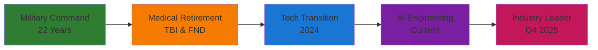

<div align="center">
  
# Jamie Scott Craik, FloL 🚀


[](https://linkedin.com/in/jamiescottcraik)
[](https://github.com/jamiescottcraik)
[](https://twitter.com/brAInwav)
[](https://brainwav.ai)

</div>

---

<div align="center">
  
  <!-- Add a custom banner image showcasing your projects -->
</div>

## 🎖️ From Battlefield to Build Space


**Founder, brAInwav | Ex-Army Warrant Officer | ILM L7 | Fellow IoL**

> 22 years of operational command taught me how to solve chaos, lead teams, and adapt under fire. Medical retirement after TBI and FND wasn't the end—it forced a reset. Now I'm applying battle-tested leadership to cutting-edge AI engineering, building technology that amplifies real minds.

<p align="left">
  
  
  
</p>

---

## 🚀 Current Mission: Q3 2025

<table>
  <tr>
    <td width="50%">
      
### 🔧 **Shipping Now**
[](https://github.com/jamiescottcraik/ai-engineering-roadmap)
- 🎯 Interactive learning platform with Glass UI
- 🤖 Multi-provider AI integration (Ollama, OpenAI, Groq)
- 📊 Kanban-based learning workflow
- ♿ WCAG 2.1 AAA accessibility

    </td>
    <td width="50%">
      
### 🏗️ **Building Next**
[](https://github.com/jamiescottcraik/paragon-ai)
- 🧠 Multi-agent cognitive assistant
- 🔒 Local-first privacy architecture
- 🎖️ Military-grade decision support
- 🌟 Neurodiverse-friendly design

    </td>
  </tr>
</table>

---

## 💻 Tech Arsenal

<div align="center">

### **Frontend & UI/UX**


### **AI & Machine Learning**


### **Backend & Infrastructure**


### **Leadership & Strategy**


</div>

---

## 📊 GitHub Analytics

<div align="center">
  
  
</div>

<div align="center">
  
</div>

---

## 🏆 Featured Projects

<div align="center">
<table>
  <tr>
    <td width="50%">
      <h3 align="center">AI Engineering Roadmap</h3>
      <div align="center">
        <a href="https://github.com/jamiescottcraik/ai-engineering-roadmap" target="_blank">
          
        </a>
        <p>
          
          
          
        </p>
        <p><strong>Interactive learning platform with Glass UI, Kanban workflow, and local AI tutoring</strong></p>
      </div>
    </td>
    <td width="50%">
      <h3 align="center">P.A.R.A.gon AI</h3>
      <div align="center">
        <a href="https://github.com/jamiescottcraik/paragon-ai" target="_blank">
          
        </a>
        <p>
          
          
          
        </p>
        <p><strong>Multi-agent cognitive assistant with local-first architecture</strong></p>
      </div>
    </td>
  </tr>
</table>
</div>

---

## 📈 Learning Journey & Progress

<div align="center">

### **2025 Roadmap Progress**


</div>



### **Current Learning Metrics**
<div align="center">
<table>
  <tr>
    <td align="center">
      
    </td>
    <td align="center">
      
    </td>
    <td align="center">
      
    </td>
  </tr>
</table>
</div>

---

## 🤝 Let's Connect & Collaborate

<div align="center">

### **Open to Opportunities In:**

<table>
  <tr>
    <td align="center">
      
      <br />
      <sub>Senior/Staff positions valuing veteran leadership</sub>
    </td>
    <td align="center">
      
      <br />
      <sub>Educational tech & accessibility projects</sub>
    </td>
    <td align="center">
      
      <br />
      <sub>Veteran transitions & inclusive AI</sub>
    </td>
  </tr>
</table>

### **Available to Contribute:**


</div>

---

## 📬 Get In Touch

<div align="center">

[](https://linkedin.com/in/jamiescottcraik)
[](https://twitter.com/brAInwav)
[](mailto:contact@brainwav.ai)
[](https://github.com/jamiescottcraik)

</div>

---

<div align="center">
  
### 💭 Current Status

```typescript
const jamie = {
  location: "UK",
  currentFocus: "AI Engineering Leadership",
  learning: ["Advanced RAG Systems", "MLOps", "Distributed Systems"],
  building: ["Interactive Learning Platform", "Multi-Agent AI Assistant"],
  advocating: "Veteran Integration in Tech",
  motto: "Signals from Lived Minds"
};
```


**Last Updated:** June 24, 2025 | **Next Milestone:** Q3 2025 Production Deployment

</div>
