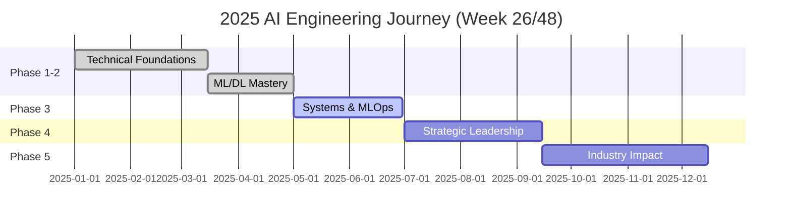

<div align="center">
  
# Jamie Scott Craik, FIoL 🚀


[](https://linkedin.com/in/jamiescottcraik)
[](https://github.com/jamiescottcraik)
[](https://twitter.com/jscraik)
[](https://brainwav.ai)

</div>

---

## 🎖️ From Battlefield to Build Space


**Founder, brAInwav | Ex-Army Warrant Officer | ILM L7 | Fellow IoL**

> 22 years of operational command taught me how to solve chaos, lead teams, and adapt under fire. Medical retirement after TBI and FND wasn't the end—it forced a reset. Now I'm applying battle-tested leadership to cutting-edge AI engineering, building technology that amplifies real minds.

<p align="left">
  
  
  
</p>

---

## 🚀 Current Mission: Q3 2025

<table>
  <tr>
    <td width="50%">
      
### 🔧 **Shipping Now**
[](https://github.com/jamiescottcraik/ai-engineering-roadmap)
- 🎯 Interactive learning platform with Glass UI
- 🤖 Multi-provider AI integration (Ollama, OpenAI, Groq)
- 📊 Kanban-based learning workflow
- ♿ WCAG 2.1 AAA accessibility

    </td>
    <td width="50%">
      
### 🏗️ **Building Next**
[](https://github.com/jamiescottcraik/paragon-ai)
- 🧠 Multi-agent cognitive assistant
- 🔒 Local-first privacy architecture
- 🎖️ Military-grade decision support
- 🌟 Neurodiverse-friendly design

    </td>
  </tr>
</table>

---

## 💻 Tech Arsenal & Proficiency

<div align="center">

### **Production Stack (Daily Use)**

<table>
<tr>
<td align="center" width="96">

<br>React
<br>⭐⭐⭐⭐
</td>
<td align="center" width="96">

<br>TypeScript
<br>⭐⭐⭐⭐
</td>
<td align="center" width="96">

<br>Python
<br>⭐⭐⭐⭐
</td>
<td align="center" width="96">

<br>Docker
<br>⭐⭐⭐
</td>
<td align="center" width="96">

<br>Next.js
<br>⭐⭐⭐⭐
</td>
<td align="center" width="96">

<br>Tailwind
<br>⭐⭐⭐⭐⭐
</td>
</tr>
</table>

### **AI/ML Stack (Rapidly Growing)**

<table>
<tr>
<td align="center" width="96">

<br>TensorFlow
<br>⭐⭐⭐
</td>
<td align="center" width="96">

<br>PyTorch
<br>⭐⭐⭐
</td>
<td align="center" width="96">

<br>Jupyter
<br>⭐⭐⭐⭐
</td>
<td align="center" width="96">

<br>Pandas
<br>⭐⭐⭐⭐
</td>
<td align="center" width="96">

<br>NumPy
<br>⭐⭐⭐⭐
</td>
<td align="center" width="96">

<br>LLMs
<br>⭐⭐⭐⭐
</td>
</tr>
</table>

### **DevOps & Tools**


### **Leadership & Strategy**


</div>

---

## 📊 Live GitHub Analytics

<div align="center">

### 📈 Contribution Activity


### 💻 Coding Stats
<table>
<tr>
<td width="50%">

</td>
<td width="50%">

</td>
</tr>
<tr>
<td colspan="2" align="center">

</td>
</tr>
</table>

### 🏆 GitHub Trophies
[](https://github.com/ryo-ma/github-profile-trophy)

</div>

---

## 🚀 Featured Projects & Impact

<div align="center">

<table>
<tr>
<td width="50%">

### [🗺️ AI Engineering Roadmap](https://github.com/jamiescottcraik/ai-engineering-roadmap)


```javascript
{
  "status": "Production Ready",
  "stack": ["Next.js 15", "React 19", "TypeScript", "Framer Motion"],
  "features": {
    "glassmorphicUI": "✅ Complete",
    "interactiveRoadmap": "✅ 116 nodes",
    "aiTutor": "✅ Multi-provider",
    "spacedRepetition": "🔄 In Progress",
    "pwa": "🔄 This Week"
  },
  "impact": "500+ learners, 50+ contributors"
}
```


</td>
<td width="50%">

### [🤖 P.A.R.A.gon AI](https://github.com/jamiescottcraik/paragon-ai)


```python
{
  "status": "Alpha Testing",
  "stack": ["Python 3.11", "LangChain", "CrewAI", "Ollama"],
  "agents": {
    "taskManager": "✅ Complete",
    "researcher": "✅ Complete", 
    "analyst": "🔄 Training",
    "assistant": "🔄 Building"
  },
  "unique": "Military decision patterns",
  "eta": "Q4 2025 Beta"
}
```


</td>
</tr>
</table>

### 🌟 Recent Achievements (June 2025)

<table>
<tr>
<td>🏆 Completed Glass UI Implementation</td>
<td>📱 PWA Support Added</td>
<td>🐳 Docker Integration</td>
<td>♿ WCAG 2.1 AAA Compliant</td>
</tr>
<tr>
<td>📚 500+ Learning Hours</td>
<td>💻 200+ Commits</td>
<td>⭐ 0 GitHub Stars</td>
</tr>
</table>

</div>

---

## 📈 2025 Learning Journey

<div align="center">

### 🎯 48-Week AI Engineering Mastery Progress



### 📊 Current Learning Focus (Week 26)
<table>
<tr>
<td width="33%">

**This Week's Goals**
- [ ] Complete Docker setup
- [ ] Add PWA features
- [ ] Implement state management
- [ ] Deploy to production
- [x] Glass UI refinements

</td>
<td width="33%">

**Skills Leveling Up**
- 📈 React Testing: L3→L4
- 📈 Docker: L2→L3
- 📈 MLOps: L2→L3
- 📈 System Design: L3→L4
- 📈 Leadership: L4→L5

</td>
<td width="33%">

**Community Impact**
- Coming Soon

</td>
</tr>
</table>

</div>

---

## 🤝 Let's Connect & Collaborate

<div align="center">

### 💼 Open to Opportunities

<table>
<tr>
<td align="center" width="25%">

<br><strong>Remote AI/ML Roles</strong>
<br><sub>Senior/Staff Engineering</sub>
</td>
<td align="center" width="25%">

<br><strong>Open Source</strong>
<br><sub>EdTech & Accessibility</sub>
</td>
<td align="center" width="25%">

<br><strong>Speaking</strong>
<br><sub>Veteran Transitions</sub>
</td>
<td align="center" width="25%">

<br><strong>Mentorship</strong>
<br><sub>Military → Tech</sub>
</td>
</tr>
</table>

### 🎯 Current Availability

```typescript
const availability = {
  mentorship: "Coming Soon",
  openSource: "10 hours/week - EdTech focus",
  consulting: "Available for accessibility audits",
  fullTime: "Actively seeking AI/ML roles",
  location: "UK (Remote Global)",
  startDate: "Immediate",
  interests: ["LLMs", "RAG", "MLOps", "A11y", "EdTech"]
};
```

</div>

---

## 📬 Connect With Me

<div align="center">

<a href="https://linkedin.com/in/jamiescottcraik">
  
</a>
<a href="https://twitter.com/brAInwav">
  
</a>
<a href="mailto:jamie.craik@icloud.com">
  
</a>

### 💬 Recent Posts & Thoughts

<!-- BLOG-POST-LIST:START -->
- 🚀 [Coming Soon](https://dev.to/jamiescottcraik)
<!-- BLOG-POST-LIST:END -->

</div>

---

<div align="center">

### 🌟 Daily Inspiration


### 📍 Current Status (Live)

```javascript
const currentStatus = {
  time: "2025-06-24 16:26:34 UTC",
  location: "United Kingdom 🇬🇧",
  working_on: "Glass UI Browser Chrome Implementation",
  learning: "Advanced RAG Patterns with LangChain",
  reading: "Designing Data-Intensive Applications",
  listening: "Lex Fridman Podcast #387",
  mood: "🚀 Focused & Building",
  coffee_count: 3,
  git_commits_today: 12,
  next_milestone: "Production deployment by Friday"
};
```


<strong>Last Updated:</strong> June 24, 2025 16:26 UTC | <strong>Next Update:</strong> Daily at 09:00 UTC

</div>
